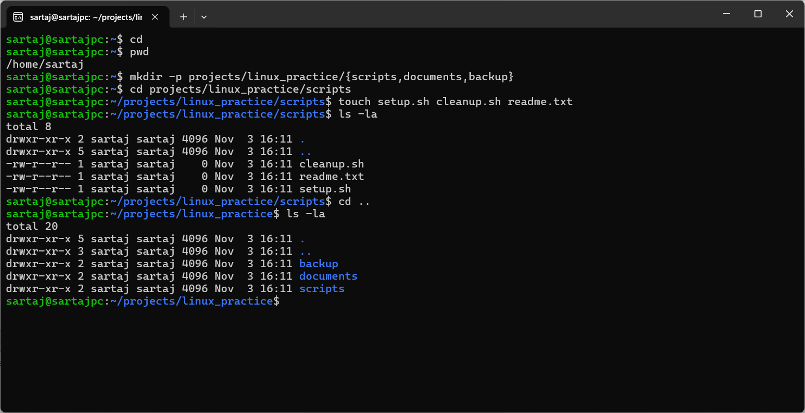
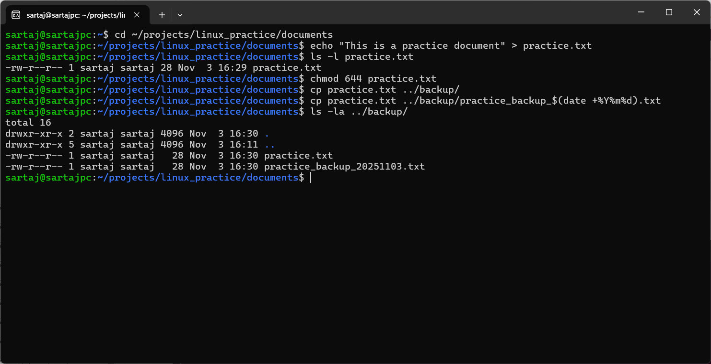
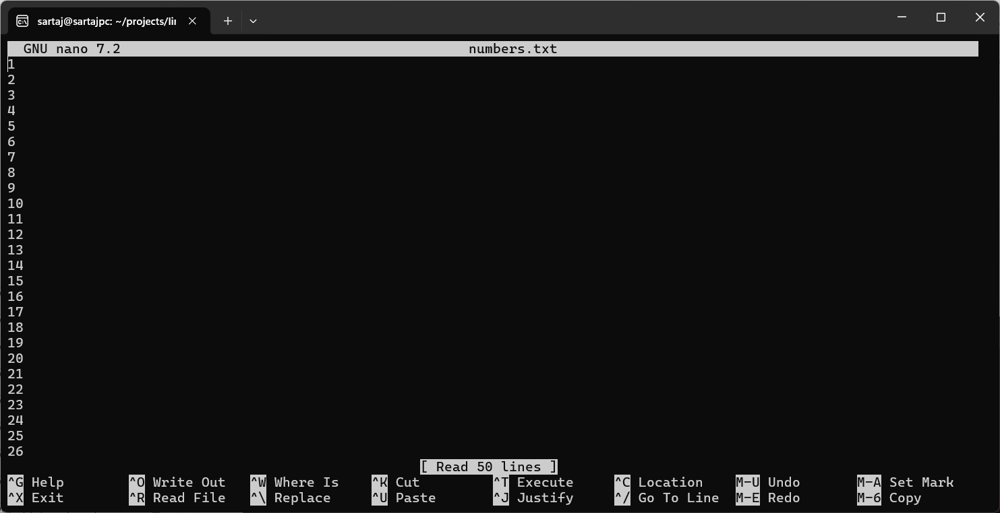
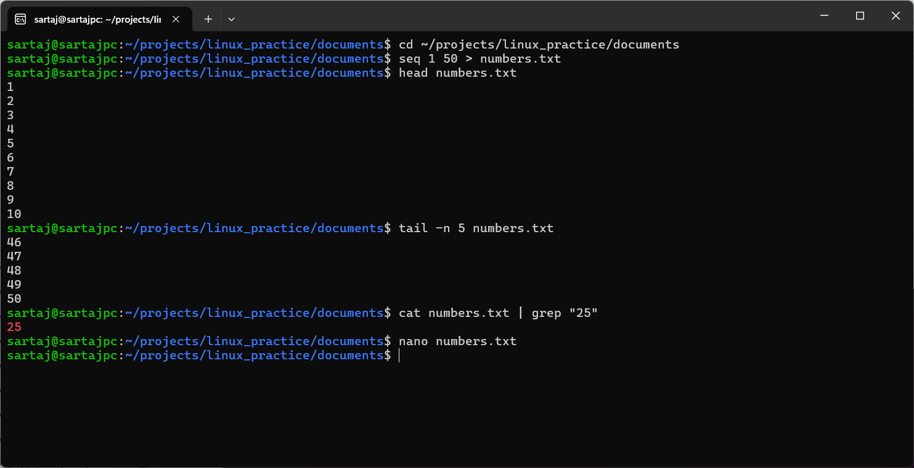
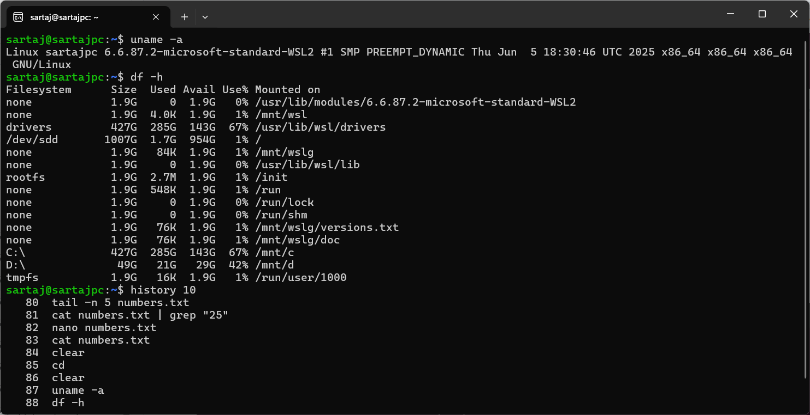
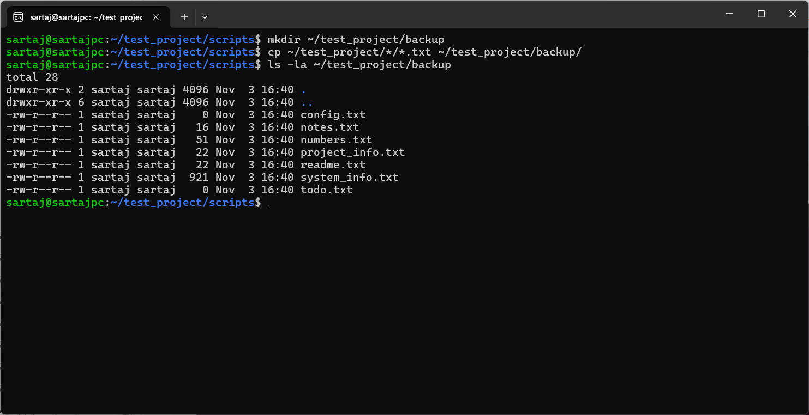
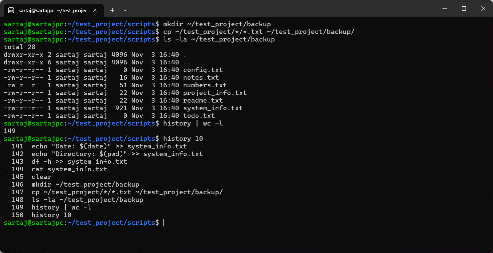

## Experiment 2: Linux File Systems, Permissions, and Essential Commands

### Name: Sartaj Singh   Roll No.: 590029227   Date: 2025-09-23

### Aim:

* To understand the structure of Linux file systems.
* To learn and practice essential navigation and file management commands.
* To explore file permissions and ownership, and manage them using Linux commands.
* To use user management, system information commands, and editing tools.
* To solve practical exercises and tasks for mastering Linux basics.

### Requirements

* A Linux machine (Ubuntu/Debian/Linux Mint or similar).
* User privileges to create, modify, and delete files.
* Access to terminal and text editors like `nano` or `vim`.

---

## Theory

Linux uses a hierarchical file system starting from the root `/`. Essential directories include `/home`, `/etc`, `/usr`, `/var`, `/bin`, and `/tmp`. File permissions are divided among **owner**, **group**, and **others**, with actions `r` (read), `w` (write), and `x` (execute). Navigation commands like `ls`, `pwd`, `cd`, and file operations (`cp`, `mv`, `rm`) form the basis of Linux usage. Editors (`nano`, `vim`) and commands for system info (`uname`, `df`, `top`, `history`) provide insights and control. Practice tasks build practical confidence.

---

## Procedure & Observations

### Section 1: File Systems and Permissions

We learned how Linux organizes directories, how to view and change file permissions using `chmod`, `chown`, and `chgrp`.

### Section 2: Navigation and File Operations

Commands like `ls`, `pwd`, `cd`, `mkdir`, `rmdir`, `touch`, `cp`, `mv`, `rm` were practiced to manage files and directories.

### Section 3: File Viewing and Editing

We used `cat`, `less`, `head`, `tail` to view file contents, and practiced editing with `nano` and `vim`.

### Section 4: User Management

Commands `whoami`, `who`, `passwd`, `sudo` were practiced to understand users and privileges.

### Section 5: System Information

Commands like `uname`, `df`, `top`, `htop`, `history` were used to gather system and process information.

### Section 6: Practice Exercises

Hands-on practice included navigation, file operations, text editing, system exploration, and cleanup.

---

## Practice Exercises

### Exercise 1: File System Navigation

```bash
cd
pwd
mkdir -p projects/linux_practice/{scripts,documents,backup}
cd projects/linux_practice/scripts
touch setup.sh cleanup.sh readme.txt
ls -la
cd ..
ls -la
```

### Output:



---

### Exercise 2: File Operations and Permissions

```bash
cd ~/projects/linux_practice/documents
echo "This is a practice document" > practice.txt
ls -l practice.txt
chmod 644 practice.txt
cp practice.txt ../backup/
cp practice.txt ../backup/practice_backup_$(date +%Y%m%d).txt
ls -la ../backup/
```

### Output:




---

### Exercise 3: Text Editing and Viewing

```bash
cd ~/projects/linux_practice/documents
seq 1 50 > numbers.txt
head numbers.txt
tail -n 5 numbers.txt
cat numbers.txt | grep "25"
nano numbers.txt
cat numbers.txt
```

### Output:






---

### Exercise 4: System Exploration

```bash
uname -a
df -h
history 10
who
whoami
top
```

### Output:


---

### Exercise 5: Cleanup

```bash
cd ~/projects/linux_practice
rm -i documents/numbers.txt
rmdir backup
rm -r backup
ls -la
history | tail -20
```

### Output:


---

## Question Bank / Lab Exam Tasks

### Task 1: Directory Navigation

```bash
mkdir -p ~/test_project/{docs,scripts,data}
cd ~/test_project/scripts
pwd
```

### Output:


---

### Task 2: File Creation and Content

```bash
cd ~/test_project/docs
touch readme.txt notes.txt todo.txt
echo "Project documentation" > readme.txt
echo "Important notes" > notes.txt
cat readme.txt
cat notes.txt
```

### Output:


---

### Task 3: File Operations

```bash
cp readme.txt ../data/project_info.txt
mv todo.txt ../scripts/
```

### Output:


---

### Task 4: File Permissions

```bash
cd ~/test_project/scripts
echo "#\!/bin/bash" > backup.sh
echo "echo Backup complete" >> backup.sh
chmod u+x backup.sh
ls -l backup.sh
```

### Output:


---

### Task 5: File Viewing

```bash
seq 1 20 > numbers.txt
head -n 5 numbers.txt
tail -n 3 numbers.txt
grep "1" numbers.txt
```

### Output:


---

### Task 6: Text Editing

```bash
nano config.txt
cat config.txt
```

### Output:


---

### Task 7: System Information

```bash
echo "Username: $(whoami)" > system_info.txt
echo "Date: $(date)" >> system_info.txt
echo "Directory: $(pwd)" >> system_info.txt
df -h >> system_info.txt
cat system_info.txt
```

### Output:


---

### Task 8: File Organization

```bash
mkdir ~/test_project/backup
cp ~/test_project/*/*.txt ~/test_project/backup/
ls -la ~/test_project/backup
```

### Output:



---

### Task 9: Process and History

```bash
history | wc -l
history 10
```

### Output:



---

### Task 10: Comprehensive Cleanup

```bash
chmod 754 backup.sh
find ~/test_project -type f | wc -l > summary.txt
find ~/test_project -type d | wc -l >> summary.txt
cat summary.txt
```

### Output:


---

## Result

* Explored Linux file system structure.
* Practiced file operations, editing, and permissions.
* Learned user and system management commands.
* Completed practical exercises and lab exam-style tasks.

## Challenges Faced & Learning Outcomes

* Challenge 1: Managing complex directory structures.
* Challenge 2: Remembering symbolic vs numeric permissions.
* Challenge 3: Using `find`, `grep`, and redirection effectively.

### Learning:

* Mastered Linux navigation, file handling, and permissions.
* Gained practical knowledge of user/system management.
* Practiced exam-style tasks to solidify learning.

## Conclusion

This experiment comprehensively covered **Linux file systems, permissions, commands, editing, user management, and system info**. The tasks ensured thorough practice, making it a complete foundation for Linux proficiency.